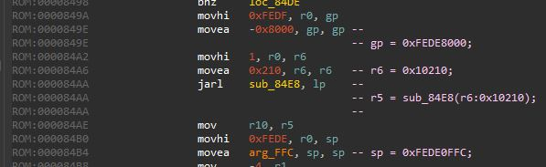
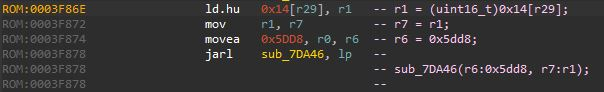
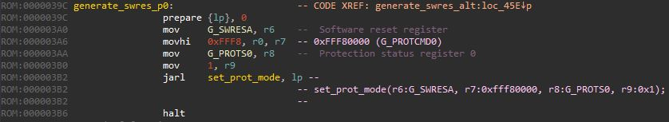
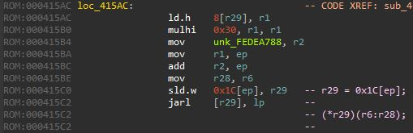
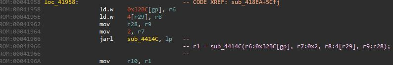
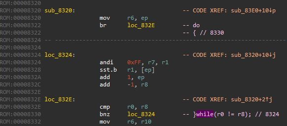

# v850-ida-scripts  
`decompv850.py` - скрипт, запускается по alt+F7 (выполнить скрипт), анализирует код и некоторые распознанные структуры снабжает комментариями в виде С-подобного кода  
`rh850_f1l.hpp` - определения структур соответсвующих устройствам на кристалле RH850/F1L
`rh850_f1l.py` - используя данные `rh850_f1l.hpp` а так же определенные внутри скрипта таблицы чтобы задать уcтройства микроконтролллера RH850/F1L   
`ida_structs.py` - набор функций позволяющий импортировать C структуры
 
# decompv850.py
Примеры результатов работ скрипта.
## анализ присвоений

- По адресам 849A-849E, 84A2-84A6 b 84B0-84B4 производится присвоение в две комманды. сначала в старшее полуслово, коммандой  `movhi`, затем в младшее коммандой `movea`  
- По адресам 84A2-84AA подгатавливаются аргументы (`r6`) функции `sub_84e8` и затем ее вызов  
  
  
- Еще один пример распознавания присвоений и подготовки аргументов функций. В следствие не достаточной сложности алгоритма, скрипт не распознает что в `r7`, через `r1` попадает значение `*(uint16_t*)(r29+0x14)` и он останавливается на `r1`, что мы и видим в вызове функции  


- При вызове функций и присвоениях, если в качестве значения будет использовано имя (будь то адрес или константа) соответсвующее имя будет подставлено в комментарий, сгенерированный скриптом, в то же время если в дизассемблере  имя не распознано (см. адрес 3A6) то будет использовано числовое значение  


- Так же распознает вызовы функций по указателю. На данный момент использует шаблон `jarl [xxx], y`  


- В качестве аргументов функции, пока, распознает только передачу параметров через регистры. До четырех аргуметнов r6-r9  


- Из циклов на данный момент распознает только один шаблон:  
```js
do{
...
}while( a ? b );
``` 
распознает условия формируемые следующими условными переходами:
- `bgt`: `a > b`
- `bge`: `a >= b`
- `blt`: `a < b`
- `ble`: `a <= b`
- `bh` : `(unsigned)a > (unsigned)b`
- `bnh`: `(unsigned)a <= (unsigned)b`
- `be` : `a == b`
- `bnl`: `(unsigned)a >= (unsigned)b`
- `bl` : `(unsigned)a < (unsigned)b`
- `bne`: `a != b`
- `bn` : `a < 0`
- `bp` : `a >= b`, 
- `br` : `true`
- `bc` : `(unsigned)a < (unsigned)b` 
- `bnc`: `(unsigned)a >= (unsigned)b`
- `bz` : `a == b` 
- `bnz`: `a != b` 
 
оставшиеся условные переходы не распознаются и их условия отображаются знаком вопроса 

     